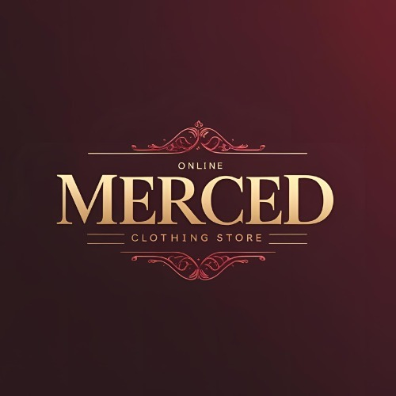

# Merced

Logo:  

## Descripción del proyecto:  
Merced es una marca de ropa que busca exhibir sus productos al mundo a través de una página web que ofrece moda accesible, moderna y global. El proyecto busca resolver la limitación geográfica y los altos costos de mantener su tienda física, transladando la experiencia de comprar a una plataforma online funcional y atractiva. Gracias a esta nueva modalidad, podremos brindar productos de excelente calidad a clientes de todo el mundo, con envíos internacionales y precios accesibles. 

### Historias de usuario:  
-Usuario 1: Como un usuario de la tienda online Merced, quiero que tenga un menú de los productos y poder filtrar los mismos, para poder encontrar lo que busco con más facilidad. 

-Usuario 2: Como un usuario de la tienda online Merced, quiero poder contactarme con los vendedores a través de un número de contacto de WhatsApp o gmail, para ante cualquier duda que surja poder consultar con los vendedores. 

-Usuario 3: Como usuario de la tienda online Merced, quisiera que el sitio cuente con un carrito de compras y una sección de pagos que muestre los métodos disponibles, para así contar con diferentes opciones a la hora de pagar. 

-Usuario 4: Como usuario de la tienda online Merced, quisiera que el sitio cuente con un apartado de redes sociales donde pueda ver referencias y comentarios de clientes anteriores, para así conocer la reputación y confianza que tiene la tienda. 

### Lista de integrantes:  
-Luciano Di Leo: Realice un curso básico de desarrollo web donde obtuve los conocimientos en HTML, CSS y JavaScript. Además realizó algunos proyectos utilizando esos mismos conocimientos, sumando con un poco de python. 

-Pedro González: Tengo conocimientos básicos de HTML, CSS y JavaScript, también realizo algunos proyectos de desarrollo.  

-Lara Gele: mis conocimientos se enfocan en el desarrollo de páginas web utilizando HTML, CSS, JavaScript y React. Realizó diversos proyectos prácticos para afianzar mis conocimientos y habilidades, desde una tienda de hamburguesas hasta una de plantas y flores. 

-Mayco David Ardiles: habilidades de testing de videojuegos, desarrollo web, programador junior, economia y gestion de empresas, electricista nivel 3. 

-Cintia Paola Osorio Duarte:Conocimientos en ux/ui , testing manual y QA, entreno IA, figma, canva, krita estudio diseño de videojuegos usando gogot como motor, tambien conocimientos en HTML, Css y JavaScript basico. 

-Conrrado Álvarez: Tecnico electricista, tecnico en higiene y seguridad laboral, y actualmente cursando lic. en higiene y saguridad, y la tecnicatura en eficiencia energetica y energia renovable. 

## Tecnologías utilizadas: 

Este proyecto se desarrollará empleando un stack tecnológico variado, que combina herramientas de desarrollo web, programación y gestión de bases de datos: 

HTML: para la estructura y el contenido de las páginas web. 

CSS: para el diseño visual, estilos y adaptación responsive. 

Python: como lenguaje de programación principal para la lógica y funcionalidades del sistema. 

MySQL: como sistema de gestión de bases de datos relacional, encargado de almacenar y organizar la información. 

WordPress: como plataforma de gestión de contenidos (CMS), que permite integrar y administrar el sitio de forma dinámica y escalable. 